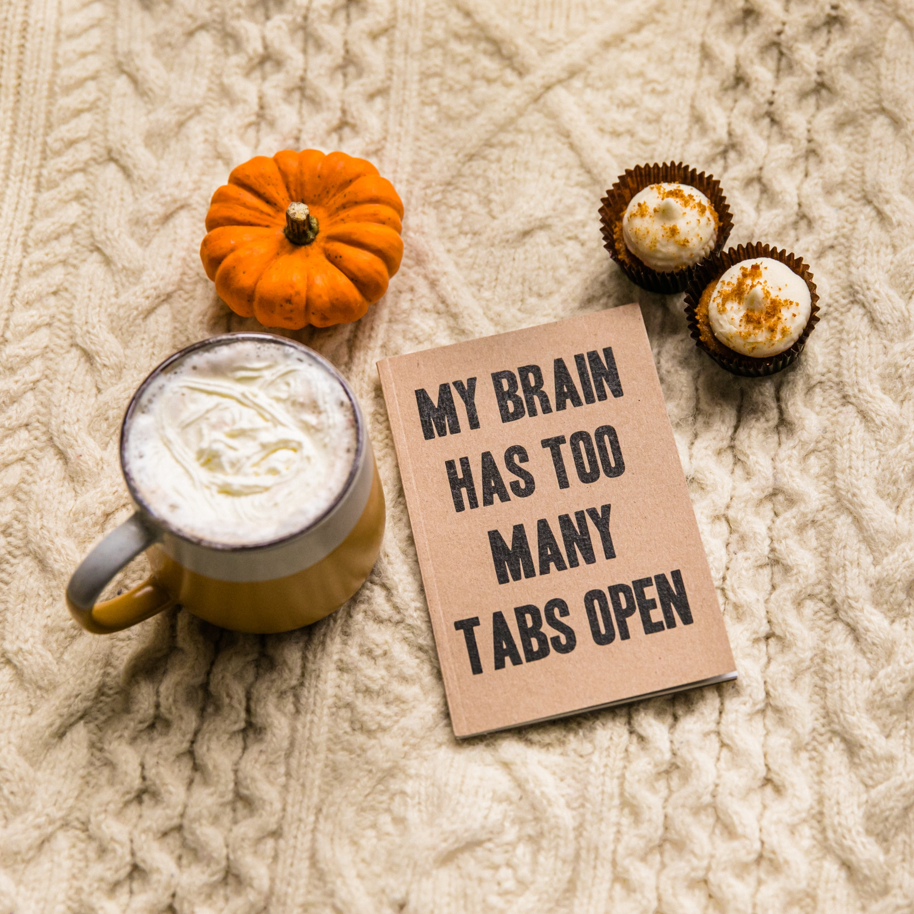

::: {}

:::

## My Research Journey

I am a first year PhD student in the University of Minnesota's Institute of Child Development. My program of study is Developmental Psychopathology and Clinical Science. Prior to beginning graduate school, I received a B.S. in Cognitive and Brain Science from Tufts University and worked as a Clinical Research Assistant in Dr. Kerry Ressler’s Neurobiology of Fear Lab at McLean Hospital. During my time in grad school I'd like to learn more about the effects of early life stress and adversity on brain and behavioral development and the mechanisms linking adversity to later psychopathology. I also hope to improve my quantitative skills and learn more about policy work.

**You can can keep track of my publications here:**

```{r load_packages, message=FALSE, warning=FALSE, include=FALSE} 
library(fontawesome)
library(kableExtra)
library(knitr)
```

```{r, echo=FALSE}

df <- data.frame(icon = c(fa("fab fa-researchgate"), 
                          fa("fas fa-graduation-cap")),
                 link = c("[ResearchGate](https://www.researchgate.net/profile/Nathalie-Dumornay/research)",
                           "[Google Scholar](https://scholar.google.com/citations?user=b4RK85IAAAAJ&hl=en&oi=ao)")
                )

kable(df, format = "html", col.names = c("", ""), align = c("l", "l"), table.attr = "style='width:20%;'", escape = FALSE) %>%  
  kable_styling(position = "left")
```